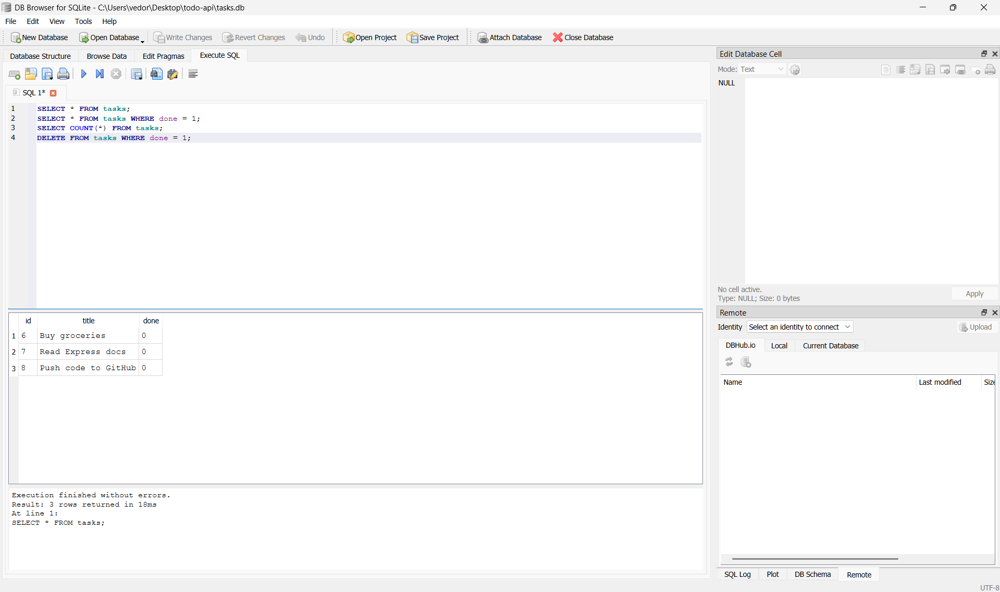

# todo-api

A REST API for managing to-do tasks. Built with Node.js and Express. Data stored in SQLite.

---

## Week 3 update — SQLite database

Tasks are now stored in a SQLite database file (`tasks.db`) instead of in memory. The data survives server restarts.

**Why SQLite?** It's a single file, needs zero setup or installation, and is created automatically the first time the server starts. Perfect for a project at this scale.

**The database file** (`tasks.db`) is git-ignored — it's created automatically on first run, so every fresh clone starts with a clean database.

---

## How to run

You need Node.js installed. Then:

```bash
git clone https://github.com/vedadramic/todo-api.git
cd todo-api
npm install
npm start
```

Server runs at `http://localhost:3000`
Swagger UI at `http://localhost:3000/docs`

The database (`tasks.db`) and table are created automatically. Three example tasks are seeded on the first run only.

---

## Endpoints

| Method | Path | What it does | Status code |
|--------|------|-------------|-------------|
| GET | `/` | API info | 200 |
| GET | `/health` | Health check | 200 |
| GET | `/tasks` | List all tasks | 200 |
| GET | `/tasks/:id` | Get one task | 200 / 404 |
| POST | `/tasks` | Create a task | 201 / 400 |
| PUT | `/tasks/:id` | Update a task | 200 / 400 / 404 |
| DELETE | `/tasks/:id` | Delete a task | 204 / 404 |

---

## Example SQL query (from Stage 4)

```sql
SELECT * FROM tasks WHERE done = 1;
```

This returns only completed tasks. After running it in DB Browser, the same result appears through the API immediately — because both read the same `tasks.db` file.

---

## Database (DB Browser)



---

## Swagger UI


---

## Note on identical endpoints

The API endpoints are identical to Week 2. The same curl commands and status codes work — only the storage layer changed from a JavaScript array to SQLite. Identical tests passing on a different storage backend is the proof that storage is just an implementation detail.